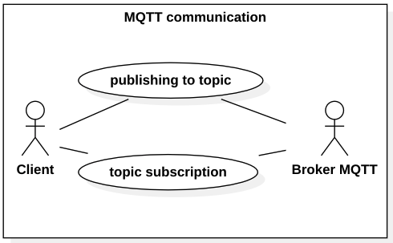
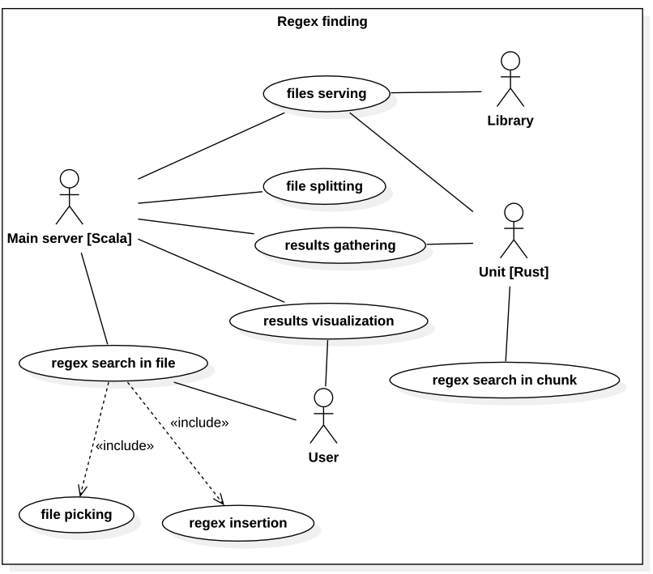
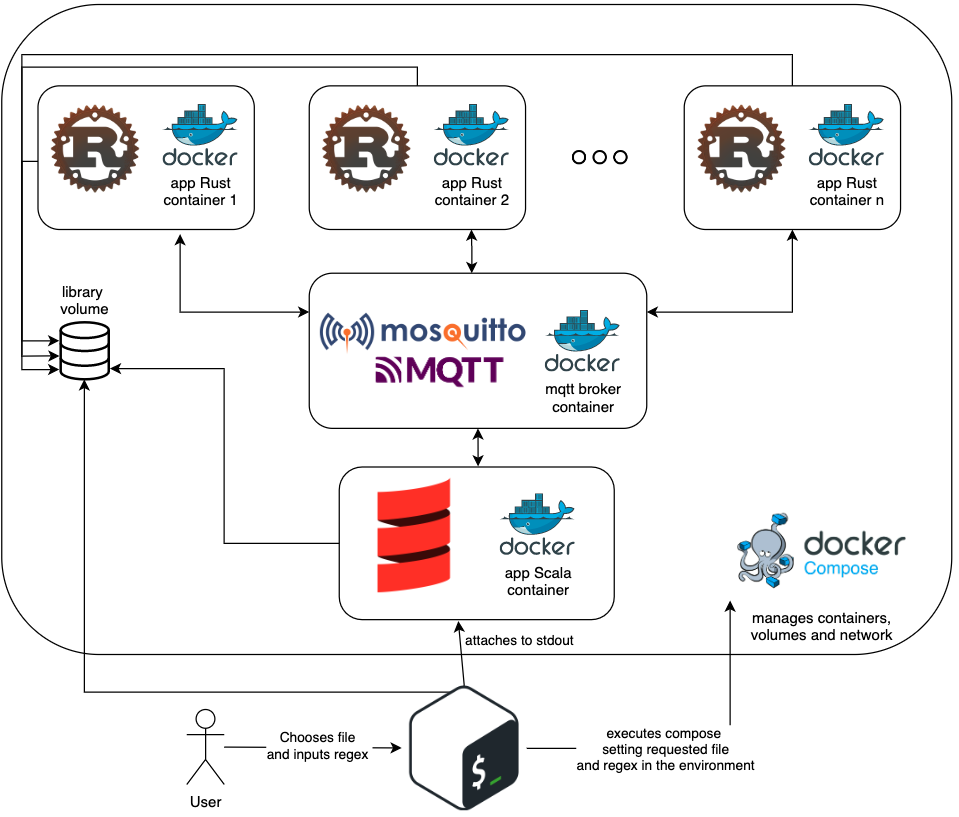

# fuzzy-guacamole
Advanced Topics in Programming Languages project @ UniPd w/ Kynetics


> Design and Implementation of a Publish/Subscribe System

---

# Introduction
The scope of this project is the implementation of a system capable of searching regular expressions in huge text files. The seeking operations are split among several independent units to make the overall search faster and more efficient. For the sake of this implementation everything runs locally on a single machine, but given the architecture the application may easily become distributed, with each unit running on a separate machine increasing this way the computational power hence the efficiency as well.

---

# Technologies adopted
## Docker
It is an open platform for developing, shipping, and running applications. It allows to define images that describe step by step how an environment should be made and configured. There is a wide set of availabile images in the [docker hub](https://hub.docker.com/) which can usually be a good place to find what you need or at least a starting point. Instantiating images gives you containers, actual environments in which you can operate without worrying to corrupt your local machine.

### Compose
It is a tool developed to help define and share multi-container applications via [YAML](https://yaml.org/) syntax.

## MQTT
MQTT (MQ Telemetry Transport) is a lightweight, publish-subscribe, machine to machine network protocol. It is primarily designed for connections with remote locations that have devices with resource constraints or limited network bandwidth. The protocol is event driven and connects devices using the publish /subscribe pattern. The sender (Publisher) and the receiver (Subscriber) communicate via Topics and are decoupled from each other. The connection between them is handled by the MQTT broker which filters all incoming messages and distributes them correctly to the Subscribers.

The [mosquitto](https://mosquitto.org/) broker has been adopted for this project.

## Scala
Scala is a strong statically typed general-purpose programming language which supports both object-oriented programming and functional programming.
Its source code can be compiled to Java bytecode and run on a Java virtual machine (JVM), leading to optimal interoperability. Given the overhead required to run it, it has been chosen to develop the central part. (Nowadays actually it's possible to compile native code with new jvm (Graal), nonetheless it remains a complex process so the choice doesn't change)

The [alpakka library](https://doc.akka.io/docs/alpakka/current/mqtt.html#) has been adopted as mqtt client.

## Rust
Rust is a multi-paradigm, general-purpose programming language which emphasizes performance, type safety, and concurrency. Rust also enforces memory safety (i.e.: all references point to valid memory) without requiring the use of a garbage collector or reference counting, mechanisms present in other memory-safe languages. Since it compiles to machine executable code it has been chosen for the units, so that they can be lightweight.

As mqtt client the [eclipse paho](https://github.com/eclipse/paho.mqtt.rust) library has been picked here.

---

# Analysis & design
## Use cases
### MQTT communication


Here we can see basically what the actors of an MQTT system do. As we anticipated earlier we have the broker which handles the connection with all the clients and is responsible to triage all the messages to the correct subscribers. While a connected client can publish messages to one or more topics and subscribe to as many topic as it needs.

### Regex search

Here we can see the business logic of our application. Let's meet our actors:
- **Library**: Contains all the available files. In this implementation it is a shared local volume, but it might as well be a web server, or another online resource;
- **Main server**: 
  - It receives the user choice regarding the regex and the file in which to search for it;
  - it handles the splitting of the file based on the number of actors, and it communicates them in which part to operate;
  - it gathers the results from each unit presenting them to the final User as they come;
- **Unit**: Several running at the same time, each one receives the instructions telling it on which file to operate (that's why it interacts with the library as well, so that the broker doesn't need to pointlessly send huge files, as it's not made for that purpose) and the regex to search. It then sends its findings back to the main server via the broker of course;
- **User**: The actual person interacting with the system, it can browse the list of files and pick one in which to search for a regex it can input.

## Architecture

In this diagram we can see all the components of the application and their interaction. Starting from the bottom we see that the end user can interact with the application via a shell script, which allows it to pick the file it likes and input the regex to search. The script then is in charge of launching the entire compose environment, in which the different part of the application run.
There are three different kind of containers:
1. **mqtt broker**: *(based on eclipse-mosquitto image)* it just needs to be run, after that the broker will be there doing its job
2. **Scala**: *(based on a custom image, more in the implementation)* handles the core business logic
3. **Rust**: *(based on a custom image)* there can be several ones of this kind, being them the unit doing the chunk-search job. As discussed previously migrating from this local setup to a distributed one with each machine running an instance of this kind is straightforward, since the communication is always done via the broker on a network.

The Scala service receives the informations about the file and the regex via the environment, set by the launching script. At this point it fetches the line count of the file from the library and computes the length of each chunk to process based on the number of available units (which it knows again from the environment). Initially it subscribes to the topics `new_client` and `results`. The former will be to acknowledge and process the connection of a new unit while the latter to gather the results from the units which will then be printed.

When a Rust unit starts it subscribes to the topic `unit_id`, where id is its own identifier (set by the environment), then it connects to the broker and publish its own id in the `new_client` topic. At this point it will receive on "its own" topic the information from the server required to start the search. Then it fetches the required chunk from the library and seek for matches of the regex. Upon completion it publishes its results to the `results` topic.

Finally the user can see the results thanks to the fact that the script, after executing compose in background, it attaches to the Scala container stdout.

---

# Implementation
The implementation follows the design and what we described so far, we can show a couple of relevant parts.

## Scala
We can notice how thanks to compose we have an easy, non dynamic address for the broker container
```Scala
val connectionSettings: MqttConnectionSettings = MqttConnectionSettings(
  "tcp://fuzzy-guacamole-mqtt-1:1883",
  "Scala-main-server",
  new MemoryPersistence 
)
```
Once we build an mqttFlow (a core part in the pipeline of the stream concept brought by Akka) configured with the connection settings, we can concisely describe a quite complex set of operations:
```Scala
val ((mqttSendQueue, subscribed), mqttReceiveQueue) = Source.queue(100)
  .viaMat(mqttFlow)(Keep.both)
  .toMat(Sink.foreach(
    m => handleNewMessage(m, jobs)
  ))(Keep.both)
  .run()
```
In this small snippet we are connecting the flow to a Sink which will receive all incoming messages, which will be forwarded to a dedicated handler function. We also get, upon materialization, the sendQueue, which we can later use to send messages to the broker on the topics of our choice, e.g.:
```Scala
mqttSendQueue.offer(MqttMessage("unit_"+k, ByteString(payloadWithJobInstructionsForUnit_k)))
```

## Rust
Albeit in a different fashion, here again we exploit the mqtt client library to configure and establish the connection to the broker. We can see how, thanks to the primitives of the language and its strict rules, we are basically forced to deal with all possible kind of erroneous situations:
```Rust
let cli = mqtt::Client::new(create_opts).unwrap_or_else(|err| {
    println!("Error creating the client: {:?}", err);
    process::exit(1);
});

// Define the set of options for the connection.
let conn_opts = mqtt::ConnectOptionsBuilder::new() // [...]

// Connect and wait for it to complete or fail.
if let Err(e) = cli.connect(conn_opts) {
    println!("Unable to connect:\n\t{:?}", e);
    process::exit(1);
}
```

Here we can see how the functional style embraced deeply by the language enables us to produce very expressive code while still being efficient and straightforward, we're then able to fetch from the file only the chunk we're told to process:
```Rust
let chunk = reader.lines()
  .skip(offset)
  .take(length)
  .map(|e| e.unwrap())
  .reduce(|a,b| a+&b).unwrap();
```

The Rust units moreover have a mechanism to recover from disconnection which works fairly well:
```Rust
fn try_reconnect(cli: &mqtt::Client) -> bool {
  println!("Connection lost. Waiting to retry connection");
  for _ in 0..12 {
      thread::sleep(Duration::from_millis(5000));
      if cli.reconnect().is_ok() {
          println!("Successfully reconnected");
          return true;
      }
  }
  println!("Unable to reconnect after several attempts.");
  false
}
```
It's not the best possible implementation since it involves a blocking operation, but better than nothing.

## About the files library
The repo contains only some files, the bigger ones are ignored to save space. Large files can be found [here](https://github.com/logpai/loghub). In any case to add file it is enough to put it in the [library folder](library/)

## The docker environment
In order to develop and run the application two custom images have been defined.

One for Scala, starting from the latest LTS ubuntu version:
```Dockerfile
FROM ubuntu:22.04
RUN apt update && apt upgrade -y
RUN apt install curl nano -y
RUN curl -fL https://github.com/coursier/launchers/raw/master/cs-x86_64-pc-linux.gz | gzip -d > cs && chmod +x cs && yes | ./cs setup
RUN grep -i export ~/.profile >> ~/.bashrc 
RUN echo 'PS1="SCALA | $PS1"' >> ~/.bashrc
WORKDIR /work
CMD bash
```
where Scala is installed following [the official instructions](https://www.Scala-lang.org/download/).

The other for Rust, starting from the official rust:1.63 image with some additional tweaks (e.g.: a dependency wouldn't build correctly without cmake):
```Dockerfile
FROM rust:1.63
RUN apt update && apt upgrade -y
RUN apt install curl nano cmake -y
RUN echo 'PS1="RUST | $PS1"' >> ~/.bashrc
WORKDIR /work
CMD bash
```

The are two versions of the compose file, one for development, which starts all the container defined and allows to connect manually to them to build & test code; while the deploy version allows a single execution of the application, it receives the filename and the regex from the bash script and proceeds as we already seen.

## Some thoughts on fault tolerance
This basic implementation does not take care too much of fault tolerance, even though it is surely an important aspect. For this reason we can wrap up here some thoughts. 
The server does not detect whether a unit connects or no, neither it checks or listen for disconnection. This means that in case one unit is broken the job that would have been assigned to it never gets done.
The units assume the server to be up and running on startup, in fact as soon as they are active they publish their id on the `new_client` topic and then wait for instructions on their own topic. If at that moment the server hasn't subscribed yet, the unit will hang forever. This is partially solved by the compose, which sets the main server as dependency for the units (which means that they do not start their activation process until the server is up) plus a timeout for the Rust app to run.
Finally, the app is not able to recognize a malformed regex, it will submit it to the system anyway, which will fail with an error.

## Bugs
Sometimes connections may fail, without recover, leaving the application stuck, especially from the Scala side.
The latest step of cargo build is extemely slow, this is probably not a bug, but still there may be an internal cause, though this happens during the development of course. The Scala app does not terminate in a "clean way" but rathers throws an InterruptedException quite often, nonetheless the cause has not been identified yet. The launching script is not super safe, it checks whether the picked file is between the range of available ones but nothing more; also no check is made on the inserted regex. The execution of the scala program in its container is not straightforward from the compose "deploy", for some reason the correct path seem not be set and the required binary (sbt) is not found, requiring a manual operation.

# Running the application
In an environment with a bash or zsh shell, it is sufficient to execute `./fuzzy_guacamole.sh`

# Challenges faced & conclusions
The learning (of the basics) of Rust and Scala required a lot of time, since both have their own quirks and perks. Especially the Alpakka library and the interaction with the broker via Scala has been extremely expensive in terms of time. I found the documentation sometimes to shallow or assuming too many things, especially compared to other technologies I've tinkered with. To start moving with these two languages surely a lot of experience is needed and you certainly cannot pick them as starters: many many concepts are too big to be understood but also appreciated, in my opinion. 
Overall I definitely enjoyed the journey which allowed me to learn and experiment a lot with very interesting subjects and technologies.
